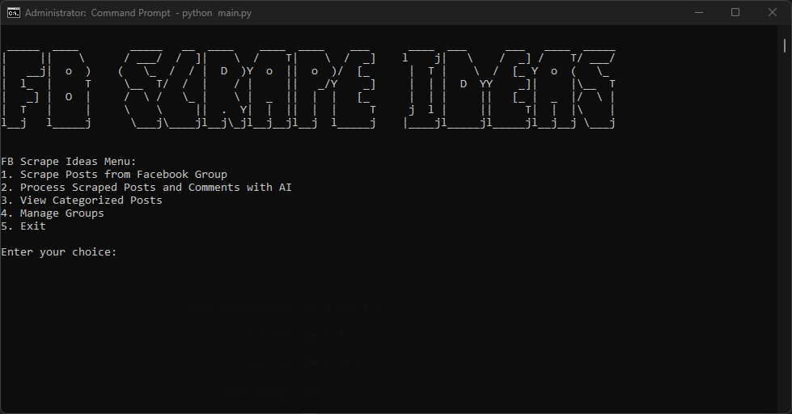

# FB Scrape Ideas

[![Python Version][python-shield]][python-url]
[![License][license-shield]][license-url]
[![Issues][issues-shield]][issues-url]
[![Forks][forks-shield]][forks-url]
[![Stars][stars-shield]][stars-url]
[![Contributors][contributors-shield]][contributors-url]

A CLI-driven application to scrape and analyze Facebook group posts for insights using Selenium and Google Gemini AI.

This tool helps users identify potential capstone/thesis ideas, student problems, or other valuable insights from university Facebook group discussions by automating data collection (including posts and comments) and AI-powered categorization.



## 📖 Table of Contents

- [FB Scrape Ideas](#fb-scrape-ideas)
  - [📖 Table of Contents](#-table-of-contents)
  - [✨ Features](#-features)
  - [📝 Scraped Data Fields](#-scraped-data-fields)
    - [🗨️ Posts](#️-posts)
    - [💬 Comments](#-comments)
    - [🔍 AI Analysis Fields](#-ai-analysis-fields)
  - [🛠️ Tech Stack](#️-tech-stack)
  - [📋 Prerequisites](#-prerequisites)
  - [🚀 Getting Started](#-getting-started)
    - [Installation](#installation)
    - [Configuration](#configuration)
  - [⚙️ Usage](#️-usage)
  - [⚠️ Important Notice](#️-important-notice)
  - [📚 Full Documentation](#-full-documentation)


## ✨ Features

*   **🔒 Authenticated Facebook Group Scraping:** Securely logs into Facebook to scrape posts and comments from private or public groups.
*   **🤖 AI-Powered Post & Comment Analysis:** Leverages Google's Gemini Flash model for intelligent categorization of posts and sentiment analysis of comments.
*   **💾 Local Database Storage:** Stores scraped data and AI insights in a local SQLite database.
*   **📊 Data Export & Statistics:** Export data to CSV/JSON and view summary statistics.
*   **💻 Command-Line Interface (CLI):** Provides easy-to-use commands for scraping, AI processing, data viewing, exporting, and statistics.

## 📝 Scraped Data Fields

The application collects the following data from Facebook group posts and comments:

### 🗨️ Posts
- Post content
- Post URL
- Post timestamp
- Author name
- Author profile picture URL

### 💬 Comments
- Comment content
- Comment timestamp
- Author name
- Author profile picture URL
- Facebook comment ID

### 🔍 AI Analysis Fields
- Category (e.g., "Project Idea", "Problem Statement")
- Sub-category
- Keywords
- Summary
- Potential idea flag
- Sentiment analysis (for comments)

## 🛠️ Tech Stack

*   **Language:** `Python`
*   **Web Scraping:**
    *   `Selenium`
    *   `webdriver-manager`
    *   `BeautifulSoup4`
*   **AI & Machine Learning:**
    *   `google-generativeai` (Google Gemini Flash)
*   **Database:**
    *   `SQLite`
*   **CLI:**
    *   `click` (or `argparse`)
*   **Utilities:**
    *   `python-dotenv`
    *   `getpass`


## 📋 Prerequisites

Before you begin, ensure you have the following:
*   Python 3.9+
*   Git
*   A modern Web Browser (e.g., Chrome, Firefox)
*   Google Cloud Project & Gemini API Key


## 🚀 Getting Started

### Installation

1.  **Clone the repository:**
    ```bash
    git clone https://github.com/MasuRii/FBScrapeIdeas.git
    cd FBScrapeIdeas
    ```
2.  **Create and activate a virtual environment:**
    ```bash
    # For Linux/macOS
    python3 -m venv venv
    source venv/bin/activate
    
    # For Windows (Command Prompt)
    python -m venv venv
    venv\Scripts\activate.bat
    ```
3.  **Install dependencies:**
    ```bash
    pip install -r requirements.txt
    ```

### Configuration

1.  **Set up Environment Variables:**
    Create a `.env` file in the project root:
    ```dotenv
    # .env
    GOOGLE_API_KEY=YOUR_GEMINI_API_KEY_HERE
    FB_USER=YOUR_FACEBOOK_EMAIL_OR_USERNAME
    FB_PASS=YOUR_FACEBOOK_PASSWORD
    ```
    (Use `.env.example` as a template)

2.  **WebDriver Setup:**
    `webdriver-manager` will handle this automatically on the first run.


## ⚙️ Usage

The application is run via the CLI:

```bash
python main.py <command> [options]
```

**Available Commands:**

*   `scrape`: Scrapes posts and comments from a Facebook group.
    ```bash
    python main.py scrape --group-url "GROUP_URL" [--num-posts 50] [--headless]
    ```
*   `process-ai`: Processes scraped posts and comments with Gemini AI.
    ```bash
    python main.py process-ai
    ```
*   `view`: Views categorized posts and comments from the database.
    ```bash
    python main.py view [--category "Project Idea"] [--limit 10]
    ```
*   `export`: Exports data to CSV or JSON format.
    ```bash
    python main.py export --format csv|json [--output-file OUTPUT] [--category "Project Idea"]
    ```
*   `stats`: Shows summary statistics about the data.
    ```bash
    python main.py stats
    ```


## ⚠️ Important Notice

**This tool is provided for educational purposes only. Users must:**
- Comply with Facebook's Terms of Service
- Respect privacy and data protection laws
- Not use scraped data for commercial purposes
- Use responsibly and ethically

The developers assume no liability for misuse of this tool. Scraping may violate Facebook's terms - use at your own risk.

## 📚 Full Documentation

For a comprehensive understanding of the project, including its architecture, detailed setup, advanced usage, and ethical considerations, please refer to the [**Full Project Documentation**](docs/PROJECT_DETAILS.md).

<!-- Shields.io links -->
[python-shield]: https://img.shields.io/badge/Python-3.9%2B-blue.svg
[python-url]: https://www.python.org/downloads/
[license-shield]: https://img.shields.io/github/license/MasuRii/FBScrapeIdeas
[license-url]: https://github.com/MasuRii/FBScrapeIdeas/blob/main/LICENSE
[issues-shield]: https://img.shields.io/github/issues/MasuRii/FBScrapeIdeas
[issues-url]: https://github.com/MasuRii/FBScrapeIdeas/issues
[forks-shield]: https://img.shields.io/github/forks/MasuRii/FBScrapeIdeas
[forks-url]: https://github.com/MasuRii/FBScrapeIdeas/network/members
[stars-shield]: https://img.shields.io/github/stars/MasuRii/FBScrapeIdeas
[stars-url]: https://github.com/MasuRii/FBScrapeIdeas/stargazers
[contributors-shield]: https://img.shields.io/github/contributors/MasuRii/FBScrapeIdeas
[contributors-url]: https://github.com/MasuRii/FBScrapeIdeas/graphs/contributors
