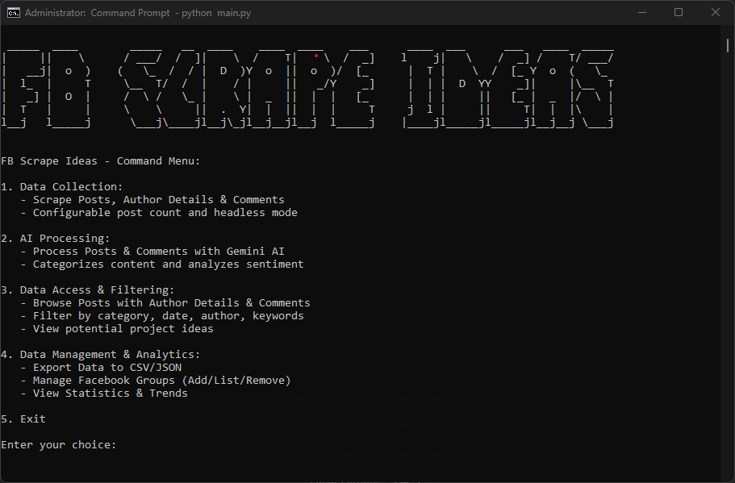

# FB Scrape Ideas

[![Python Version][python-shield]][python-url]
[![License][license-shield]][license-url]
[![Issues][issues-shield]][issues-url]
[![Forks][forks-shield]][forks-url]
[![Stars][stars-shield]][stars-url]
[![Contributors][contributors-shield]][contributors-url]

A CLI-driven application to scrape and analyze Facebook group posts for insights using Selenium and Google Gemini AI.

This tool helps users identify potential capstone/thesis ideas, student problems, or other valuable insights from university Facebook group discussions by automating data collection (including posts and comments) and AI-powered categorization.




## 📖 Table of Contents

- [FB Scrape Ideas](#fb-scrape-ideas)
  - [📖 Table of Contents](#-table-of-contents)
  - [✨ Features](#-features)
  - [📝 Scraped Data Fields](#-scraped-data-fields)
    - [🗨️ Posts](#️-posts)
    - [💬 Comments](#-comments)
    - [🔍 AI Analysis Fields](#-ai-analysis-fields)
  - [🛠️ Tech Stack](#️-tech-stack)
  - [📋 Prerequisites](#-prerequisites)
  - [🚀 Getting Started](#-getting-started)
    - [Installation](#installation)
    - [Configuration](#configuration)
  - [⚙️ Usage](#️-usage)
  - [⚠️ Important Notice](#️-important-notice)

## ✨ Features

*   **🔒 Authenticated Facebook Group Scraping:** Securely logs into Facebook to scrape posts and comments from private or public groups.
*   **🤖 Flexible AI Analysis:** 
    *   Support for **Google Gemini** (default) and **OpenAI-compatible** providers (OpenAI, Ollama, LM Studio, etc.)
    *   Configurable models (e.g., switch between Gemini 2.5 Pro, 2.0 Flash, or local LLMs)
    *   **Customizable Prompts:** Override default AI prompts via JSON configuration
*   **💾 Local Database Storage:** Stores scraped data and AI insights in a local SQLite database.
*   **📊 Data Export & Statistics:** Export data to CSV/JSON formats and view detailed statistics.
*   **💻 Advanced CLI Interface:**
    *   **Dynamic Filtering:** Filter posts by category, author, or potential ideas
    *   **Pagination:** Limit results with `--limit` option
    *   **Interactive Menus:** User-friendly command selection
*   **⚡ Performance Optimizations:**
    *   Parallel processing for faster scraping
    *   Asynchronous AI batch processing
    *   Incremental data saving during scraping
*   **📤 Enhanced Export Capabilities:**
    *   Flexible output paths
    *   Multiple export formats (CSV/JSON)
    *   Automatic directory creation

## 📝 Scraped Data Fields

The application collects the following data from Facebook group posts and comments:

### 🗨️ Posts
- Post content
- Post URL
- Post timestamp
- Author name
- Author profile picture URL

### 💬 Comments
- Comment content
- Comment timestamp
- Author name
- Author profile picture URL
- Facebook comment ID

### 🔍 AI Analysis Fields
- Category (e.g., "Project Idea", "Problem Statement")
- Sub-category
- Keywords
- Summary
- Potential idea flag
- Sentiment analysis (for comments)

## 🛠️ Tech Stack

*   **Language:** `Python`
*   **Web Scraping:**
    *   `Selenium`
    *   `webdriver-manager`
    *   `BeautifulSoup4`
*   **AI & Machine Learning:**
    *   `google-generativeai`
*   **Database:**
    *   `SQLite`
*   **CLI:**
    *   `click`
*   **Utilities:**
    *   `python-dotenv`
    *   `getpass`


## 📋 Prerequisites

Before you begin, ensure you have the following:
*   Python 3.9+
*   Git
*   A modern Web Browser (e.g., Chrome, Firefox)
*   Google Cloud Project & Gemini API Key


## 🚀 Getting Started

### 📦 Option 1: Binary Release (Easiest)
For most users, we recommend using the pre-compiled binaries:
1.  **Download** the latest version for your platform from the [Releases](https://github.com/MasuRii/FBScrapeIdeas/releases) page.
2.  **Run the application:**
    - **Windows:** Double-click `FBScrapeIdeas-windows-x64.exe`.
    - **macOS/Linux:** Open a terminal, make the file executable (`chmod +x FBScrapeIdeas-*`), and run it.
3.  **Interactive Setup:** On the first launch, the application will guide you through an interactive wizard to configure your API keys and credentials. **No manual `.env` file creation is required!**

---

### 🛠️ Option 2: Running from Source (For Developers)

1.  **Clone the repository:**
    ```bash
    git clone https://github.com/MasuRii/FBScrapeIdeas.git
    cd FBScrapeIdeas
    ```
2.  **Create and activate a virtual environment:**
    ```bash
    # For Linux/macOS
    python3 -m venv venv
    source venv/bin/activate
    
    # For Windows (Command Prompt)
    python -m venv venv
    venv\Scripts\activate.bat
    ```
3.  **Install dependencies:**
    ```bash
    pip install -r requirements.txt
    ```

### Configuration (Manual)

If you prefer to configure the application manually (e.g., for automated environments):

1.  **Set up Environment Variables:**
    Create a `.env` file in the project root:
    ```dotenv
    # .env
    
    # Provider Selection (gemini or openai)
    AI_PROVIDER=gemini
    
    # Gemini Configuration
    GOOGLE_API_KEY=YOUR_GEMINI_API_KEY_HERE
    GEMINI_MODEL=models/gemini-2.5-flash
    ```
    (See [AI Provider Configuration](#ai-provider-configuration) for more details)
    > Note: Facebook credentials are entered securely during scraping or saved during the first-run interactive session.

2.  **WebDriver Setup:**
    `webdriver-manager` will handle this automatically on the first run.


## 🧠 AI Provider Configuration

FB Scrape Ideas supports multiple AI providers, allowing you to choose between Google's Gemini models, OpenAI's official API, or local LLMs running via tools like Ollama or LM Studio.

You can configure these settings via the `.env` file or the CLI menu.

### 🔹 Using Google Gemini (Default)

This is the default provider. You only need a Google API Key.

**Configuration (`.env`):**
```dotenv
AI_PROVIDER=gemini
GOOGLE_API_KEY=your_google_api_key
GEMINI_MODEL=models/gemini-2.0-flash  # Optional: Change model
```

**Available Gemini Models:**
- `models/gemini-2.0-flash` (Fast, efficient)
- `models/gemini-1.5-flash`
- `models/gemini-1.5-pro` (Higher reasoning capability)

### 🔹 Using OpenAI-Compatible Providers

You can connect to any service that follows the OpenAI API standard, including local LLMs.

#### 1. Official OpenAI
```dotenv
AI_PROVIDER=openai
OPENAI_API_KEY=sk-...
OPENAI_MODEL=gpt-5o
```

#### 2. Ollama (Local LLM)
Run Ollama locally (`ollama serve`) and use the following config:
```dotenv
AI_PROVIDER=openai
OPENAI_BASE_URL=http://localhost:11434/v1
OPENAI_API_KEY=ollama  # Value doesn't matter for Ollama, but must be present
OPENAI_MODEL=llama3    # Or any model you have pulled
```

#### 3. LM Studio (Local LLM)
Start the local server in LM Studio and use:
```dotenv
AI_PROVIDER=openai
OPENAI_BASE_URL=http://localhost:1234/v1
OPENAI_API_KEY=lm-studio
OPENAI_MODEL=model-identifier
```

#### 4. OpenRouter / Together AI / Groq
Point the `OPENAI_BASE_URL` to the provider's endpoint:
```dotenv
AI_PROVIDER=openai
OPENAI_BASE_URL=https://openrouter.ai/api/v1
OPENAI_API_KEY=your_openrouter_key
OPENAI_MODEL=anthropic/claude-3-opus
```

### 🔹 Custom Prompts

You can customize the instructions given to the AI by creating a `custom_prompts.json` file in the root directory. This allows you to tailor the categorization logic or sentiment analysis to your specific needs.

**To use:**
1. Copy `custom_prompts.example.json` to `custom_prompts.json`.
2. Edit the prompts in `custom_prompts.json`.

**Example Structure:**
```json
{
  "post_categorization": "You are an expert post categorizer. Analyze the following...",
  "comment_analysis": "You are an expert comment analyzer..."
}
```

## ⚙️ Usage

The application is run via the CLI:

```bash
python main.py <command> [options]
```

**Available Commands:**

*   `scrape`: Scrapes posts and comments from a Facebook group.
    ```bash
    python main.py scrape --group-url "GROUP_URL" [--num-posts 50] [--headless]
    ```
    > You'll be prompted securely for Facebook credentials
    
*   `process-ai`: Processes scraped posts and comments with the configured AI provider.
    ```bash
    python main.py process-ai
    ```
    
*   `view`: Views categorized posts and comments with filtering options:
    ```bash
    python main.py view [--category CATEGORY] [--author AUTHOR] [--limit N]
    ```
    *   Interactive field and value selection
    *   Pagination support
    
*   `export`: Exports data to CSV or JSON format:
    ```bash
    python main.py export --format csv|json [--output-path PATH] [--category CATEGORY]
    ```
    *   Handles both posts and comments
    *   Automatic directory creation
    
*   `stats`: Shows comprehensive statistics about collected data:
    ```bash
    python main.py stats
    ```


## ⚠️ Important Notice

**This tool is provided for educational purposes only. Users must:**
- Comply with Facebook's Terms of Service
- Respect privacy and data protection laws
- Not use scraped data for commercial purposes
- Use responsibly and ethically

The developers assume no liability for misuse of this tool. Scraping may violate Facebook's terms - use at your own risk.

<!-- Shields.io links -->
[python-shield]: https://img.shields.io/badge/Python-3.9%2B-blue.svg
[python-url]: https://www.python.org/downloads/
[license-shield]: https://img.shields.io/github/license/MasuRii/FBScrapeIdeas
[license-url]: https://github.com/MasuRii/FBScrapeIdeas/blob/master/LICENSE
[issues-shield]: https://img.shields.io/github/issues/MasuRii/FBScrapeIdeas
[issues-url]: https://github.com/MasuRii/FBScrapeIdeas/issues
[forks-shield]: https://img.shields.io/github/forks/MasuRii/FBScrapeIdeas
[forks-url]: https://github.com/MasuRii/FBScrapeIdeas/network/members
[stars-shield]: https://img.shields.io/github/stars/MasuRii/FBScrapeIdeas
[stars-url]: https://github.com/MasuRii/FBScrapeIdeas/stargazers
[contributors-shield]: https://img.shields.io/github/contributors/MasuRii/FBScrapeIdeas
[contributors-url]: https://github.com/MasuRii/FBScrapeIdeas/graphs/contributors
