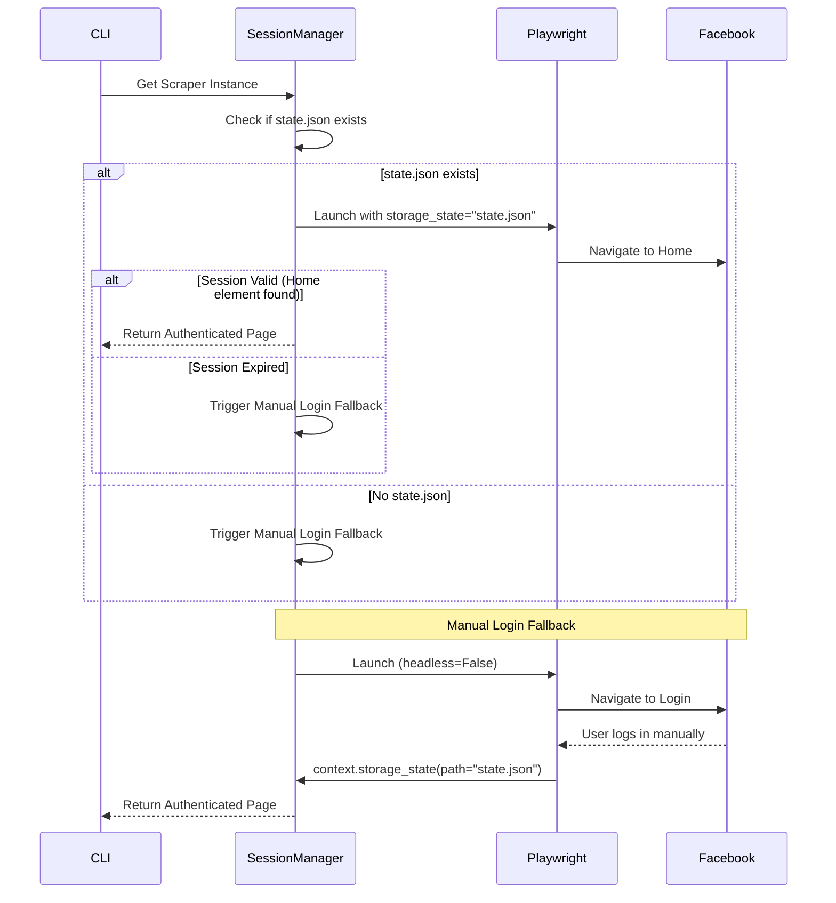

# Architecture Plan: Playwright Migration & AI Pipeline 2.0 (2025 Upgrade)

**Date:** December 29, 2025
**Status:** DRAFT
**Parent Goal:** Modernize FB Scrape Ideas with Playwright and Real-time AI Filtering.

---

## 1. Playwright Scraper Architecture

We are moving from a synchronous Selenium-based approach to an asynchronous Playwright-based architecture. This allows for better performance, resilient "storage state" handling, and more robust anti-detection.

### 2025 Extraction Patterns:
*   **Discussion Tab Anchor**: Facebook often lands on "Featured" or "About" tabs. We will explicitly target the "Discussion" tab URL or click the tab element to ensure we are at the feed source.
*   **DOM-Ready Waiter**: Instead of fixed sleeps, we use `page.waitForFunction` to detect when skeleton placeholders are replaced by real content (e.g., checking for `article` elements with text length > 100).
*   **Gradual Scroll**: Emulating human behavior by scrolling in 600-900px increments with randomized delays.

### Class Breakdown: `PlaywrightScraper`
Located in: `scraper/playwright_scraper.py`

| Method | Responsibility |
|--------|----------------|
| `__init__(self, headless=True)` | Initializes Playwright and browser settings. |
| `async run(self, group_url, limit)` | Orchestrates the scraping process. |
| `async _setup_context(self)` | Configures `browser_context` with `storage_state`. |
| `async _navigate_to_target(self, url)` | Navigates to group and ensures "Discussion" tab is active. |
| `async _scroll_gradually(self)` | Performs human-like scrolling (800px increments). |
| `async _extract_posts(self)` | Uses `waitForFunction` and fallback selectors to grab DOM. |
| `async _dismiss_overlays(self)` | Playwright-specific logic to click "Not Now", "Close", etc. |

---

## 2. Session Lifecycle & Storage State

Playwright's `storage_state` is the core of our 2025 session management.

### `SessionManager` Flow
Located in: `scraper/session_manager.py`



---

## 3. AI Pipeline 2.0 (Real-time Filtering)

To reduce LLM costs and noise, we implement a multi-stage filtering pipeline.

### Pipeline Logic: `Keyword Pre-filter` -> `LLM Classification`
Located in: `ai/filtering_pipeline.py`

1.  **Stage 1: Keyword Pre-filter (Local)**
    *   Compare post text against a list of "high-signal" keywords (e.g., 'idea', 'problem', 'help', 'app', 'tool').
    *   If no keywords match, discard the post immediately (Cost: $0).
2.  **Stage 2: LLM Classification (Remote)**
    *   Send matched posts to Gemini 2.0 Flash using Structured Outputs.
    *   Confirm relevance and extract metadata.
3.  **Stage 3: Database Storage**
    *   Save only "AI-Verified" or "Potentially Interesting" posts to SQLite.

---

## 4. Structured Data Schema

We will use Gemini's `response_mime_type: "application/json"` with a strict schema to ensure reliability. We are unifying the schemas to include `sentiment` for posts, which was previously only in the comment schema.

### Updated Post Schema (`ai/gemini_schema.json`):
```json
{
  "type": "ARRAY",
  "items": {
    "type": "OBJECT",
    "properties": {
      "postId": { "type": "STRING" },
      "category": { "type": "STRING" },
      "subCategory": { "type": "STRING" },
      "sentiment": { 
        "type": "STRING", 
        "enum": ["positive", "negative", "neutral", "frustrated"] 
      },
      "keywords": { "type": "ARRAY", "items": { "type": "STRING" } },
      "summary": { "type": "STRING" },
      "isPotentialIdea": { "type": "BOOLEAN" },
      "reasoning": { "type": "STRING" }
    },
    "required": ["postId", "category", "sentiment", "keywords", "summary", "isPotentialIdea", "reasoning"]
  }
}
```

---

## 5. Migration Strategy

We will NOT remove Selenium immediately. We will support both engines during the transition.

### Step-by-Step Implementation:
1.  **Create New Modules**: `playwright_scraper.py`, `session_manager.py`, `filtering_pipeline.py`.
2.  **Update Config**: Add `SCRAPER_ENGINE` (default: 'selenium' for now) and `SESSION_STATE_PATH`.
3.  **Update CLI**: Add a toggle in `menu_handler.py` to test the Playwright engine.
4.  **Verification**: Run `tests/smoke_test_playwright.py` to compare results with Selenium.
5.  **Deprecation**: Once Playwright is stable, update `main.py` to use it as the default and mark Selenium as "Legacy".

---

## 6. File Impact Matrix

| File Path | Action | Description |
|-----------|--------|-------------|
| `scraper/playwright_scraper.py` | **NEW** | Main Playwright engine. |
| `scraper/session_manager.py` | **NEW** | `storage_state` handler and login fallback. |
| `ai/filtering_pipeline.py` | **NEW** | Keyword pre-filter logic. |
| `ai/gemini_provider.py` | **EDIT** | Add support for Structured Output (JSON mode). |
| `database/crud.py` | **EDIT** | Add fields for `sentiment` if required (or map to existing). |
| `config.py` | **EDIT** | Add Playwright-specific configurations. |
| `main.py` | **EDIT** | Add engine selection CLI argument. |

---

**Approval Required:** 
Does this plan look complete and correct to you? Any changes, additions, or concerns before we proceed to implementation?
